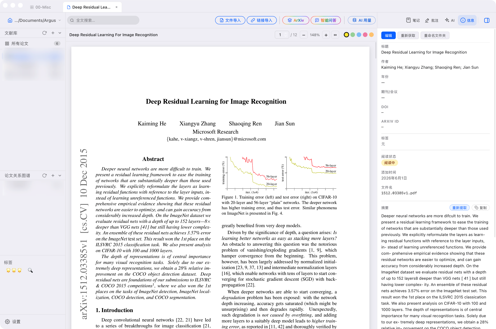

<p align="center">
  
</p>

<h1 align="center">Argus</h1>

<p align="center">
  <strong>一个本地优先的论文工作台，整合文献管理、笔记、arXiv、RAG 和 AI 辅助阅读。</strong>
</p>

<p align="center">
  <a href="./README.md">English</a>
  ·
  简体中文
</p>

<p align="center">
  <a href="#核心功能">核心功能</a>
  ·
  <a href="#开发">开发</a>
  ·
  <a href="#状态">状态</a>
</p>

> [!CAUTION]
> **这个项目的大部分代码由 AI 生成 / 辅助生成。**
>
> Argus 目前仍在持续 debug 和 improve。请谨慎使用，并保留文献库备份。

<p align="center">
  
</p>

Argus 是一个面向学术论文的桌面应用。它把 PDF 阅读、元数据提取、笔记、arXiv 跟踪、论文关系图谱，以及基于文献库的 AI 问答放在同一个本地优先的工作流里。

## 核心功能

| 功能 | 简介 |
| --- | --- |
| 文献库管理 | 导入 PDF，管理文件夹和标签，记录阅读状态，并集中维护论文元数据。 |
| 阅读与笔记 | 用标签页阅读 PDF，写笔记、做批注，并快速复制摘要或提取出的全文。 |
| AI 工作流 | 用可配置提示词提取元数据、从原文抽取摘要，并生成论文分析。 |
| arXiv 与 RAG | 跟踪 arXiv 推荐，导入有价值的论文，建立语义搜索，并带来源地提问整个文献库。 |
| 论文关系图谱 | 把论文放到画布上，连接相关工作，并导出论文关系图。 |

## 安装（macOS）

从 [Releases](../../releases) 页下载 `.dmg` 安装后，需要在终端运行以下命令清除系统隔离标记，否则 macOS 会阻止应用打开：

```bash
xattr -cr /Applications/Argus.app
```

## 编译部署

```bash
npm run build
npm run tauri build
```

## 状态

Argus 仍处于实验阶段，并且正在持续开发中。界面、流程和 AI/RAG 行为都可能继续调整，AI 输出也需要人工核验。
