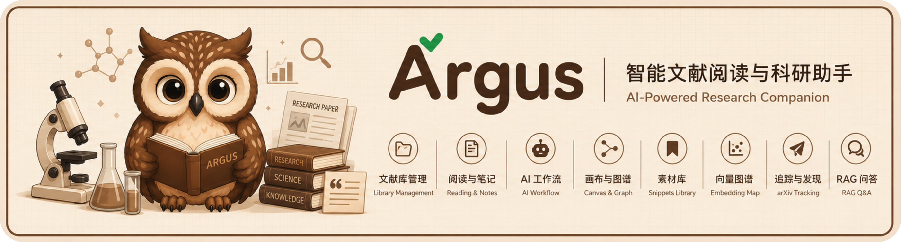

<p align="center">
  
</p>

<p align="center">
  <strong>轻量、AI 原生、本地优先的文献阅读软件，让你在阅读、分析、检索论文的同时就能与论文对话。</strong>
</p>

<p align="center">
  <a href="./README.md">English</a>
  ·
  简体中文
</p>

<p align="center">
  <a href="https://chenwen245299.github.io/Argus/zh/">官网</a>
  ·
  <a href="https://chenwen245299.github.io/Argus/zh/guide/introduction">使用文档</a>
  ·
  <a href="https://chenwen245299.github.io/Argus/zh/download">下载</a>
  ·
  <a href="#安装macos">安装</a>
</p>

> [!CAUTION]
> **本项目的大部分代码由 AI 生成 / 辅助生成。** Argus 目前功能已趋于稳定，本人已经在 macOS 26 系统上高强度使用了一段时间，基本修复了大部分 bug，目前在 macOS 26 上体验流畅。Windows 系统上基本功能也都能正常运行。

<p align="center">
  
</p>

Argus 是一款轻量、AI 原生、**本地优先**的文献阅读软件，用于阅读、分析、检索你的学术论文，并与论文对话 —— 一切都在一个桌面应用里完成。它把 PDF 与电子书阅读、AI 功能、笔记、arXiv 追踪、论文关系图谱、素材库，以及全库 RAG 检索与论文分析整合到一处，让你的整个科研阅读流程集中在同一个地方，并能无缝融合 AI。

> 📖 完整文档、截图与演示视频： https://chenwen245299.github.io/Argus/zh/guide/introduction

## 设计理念

- **本地优先** —— 你的 PDF、笔记、高亮、对话记录和 AI 分析，都存放在**你自己**选择的文献库文件夹里，就在**你自己**的电脑上。不绑定云、无需注册账号、数据能够轻松迁移。
- **AI 原生** —— AI 不是外挂功能，也不需要额外插件，而是作为原生能力直接融入 App。你可以自由地用 AI 分析、讲解、总结论文，回答各种问题。支持各种常见接口格式（OpenAI、Anthropic、OpenRouter、Ollama，或任意 OpenAI 兼容接口）。
- **轻量** —— 基于 [Tauri](https://tauri.app/) 构建，安装体积小（20MB~）、启动快。

## 核心功能

| 领域 | 简介 |
| --- | --- |
| [文献库管理](https://chenwen245299.github.io/Argus/zh/guide/library) | 导入 PDF 与电子书，用文件夹和标签整理，记录阅读状态，集中维护元数据。 |
| [阅读与笔记](https://chenwen245299.github.io/Argus/zh/guide/reading) | 标签页阅读 PDF、高亮批注，并用带 OCR 兜底的全文提取撰写富文本笔记。 |
| [AI 工作流](https://chenwen245299.github.io/Argus/zh/guide/ai) | 配置任意提供商与模型，提取元数据与摘要、生成可配置分析，并与任意论文对话。 |
| [画布](https://chenwen245299.github.io/Argus/zh/guide/canvas) | 把论文作为节点排布、连接相关工作，梳理发展脉络，并导出关系图谱。 |
| [素材库](https://chenwen245299.github.io/Argus/zh/guide/snippets) | 收集阅读时的摘录，基于独立向量库做语义检索，方便写作时查找与引用。 |
| [向量图谱](https://chenwen245299.github.io/Argus/zh/guide/embedding-map) | 把文献库的 embedding 投影到二维图，可视化论文聚类、发现潜在关联。 |
| [arXiv / bioRxiv 追踪](https://chenwen245299.github.io/Argus/zh/guide/arxiv) | 定时抓取预印本、按 AI 相关性过滤，在每日收件箱集中处理。 |
| [RAG 问答](https://chenwen245299.github.io/Argus/zh/guide/rag) | 构建本地向量索引，带来源地对整个文献库提问与检索。 |

## 安装（macOS）

从 [Releases](../../releases) 页（或 [下载页](https://chenwen245299.github.io/Argus/zh/download)）下载 `.dmg`，安装后需要在终端运行以下命令清除系统隔离标记，否则 macOS 会阻止应用打开：

```bash
xattr -cr /Applications/Argus.app
```

更多细节与 Windows 说明见 [安装教程](https://chenwen245299.github.io/Argus/zh/guide/installation)。

## 开发

```bash
npm install
npm run tauri dev      # 开发模式运行桌面应用
npm run tauri build    # 构建安装包
```

## 适合谁

Argus 主要面向**科研人员、博士生，以及任何需要一边管理不断增长的文献库、一边写论文**的人 —— 希望用一个轻量、AI 原生的软件来辅助阅读、分析和整理文献。

## 状态

Argus 在 macOS 26 上已趋于稳定（高强度使用、大部分 bug 已修复），Windows 上基本功能也能正常运行。项目仍在持续改进，可能存在少量粗糙之处，请注意保留文献库备份。
